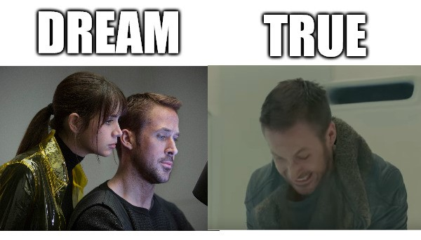
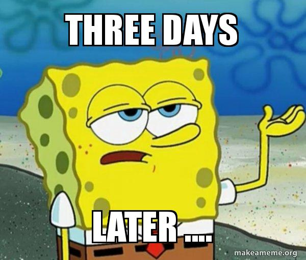
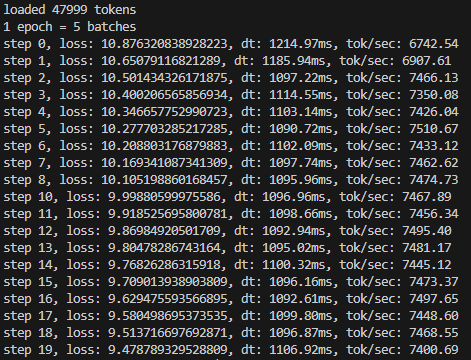
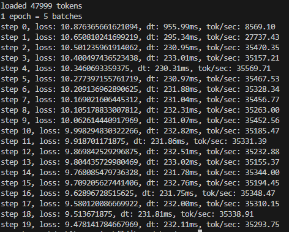
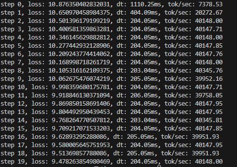

# BladeGPT

Have you seen the movie "Blade Runner 2049" ?  
Well, I liked the charater 'Officer K' acted by Ryan Gosling.  
So I want to make a nano-scaled GPT for generate sentences that resemble the way officer K speaks.

## How I feel when I start building a Model

## Result

## Speed Test
<table>
  <tr>
    <td></td>
    <td></td>
    <td></td>
  </tr>
</table>

Same input, Same batch size, Same epochs  
From Left To Right  
- Vanila : circa 1100 ms
- After precision : circa 230 ms
- After flash attention : circa 204 ms 

*Unfortunately, I cannot use `torch.complie()`*

## Notes
- Number of Batch size should be multiple of 2 with the reason of the way GPU works
- zero_grad, backward, step
- Don't forget the weight sharing
- According to Xavier initialization, when we initiate weights, std should be (**1/sqrt(num_features)**)
- If there are residual layers, we have to also account for it by scaling the factor(**1/sqrt(num_residual layer)**) in weight init
- We have to synchronize cuda with cpu when we benchmark speeds. `torch.cuda.synchronize()`
- We can speed up the process with lower precision (TF32, bfloat16 etc.)
- Always do `torch.compile()` default since it optimize the python code and also does kernel fusion, which operates multiple kernels or funcs with one roundtrip between GPU and HBM.
- Flash Attention fuses kernels like compiler. We use this since the compiler cannot optimize the attention algorithm.

## History
- 2024/06/14 
  - Finish skeleton code for GPT 
  - read txt file and tokenize it
  - Install tiktoken
  
- 2024/06/15
  - Make a class for config
  - Aggregate two attetion classes into one class
  - Add some assertation statements
  - Add a generating token code

- 2024/06/17
  - Make a dataloader class
  - Add optimizing training loop code
  - Add weight sharing scheme (wte = lm_head)
  - Add Xavier initialization and residual scale factors for init

- 2024/06/19
  - Add speed check codes
  - Mixed precision using `torch.autocast()` and `torch.set_float32_matmul_precision()`
  - compile the model (it does not support with python version 3.12, so I will downgrade to 3.11)
  - Flash Attention!

- 2024/06/23
  - Gradient accumulation
  - Save model
  - change the txt files to Witchers

## Reference
- This repo is based on Andrej Karpathy's lecture.